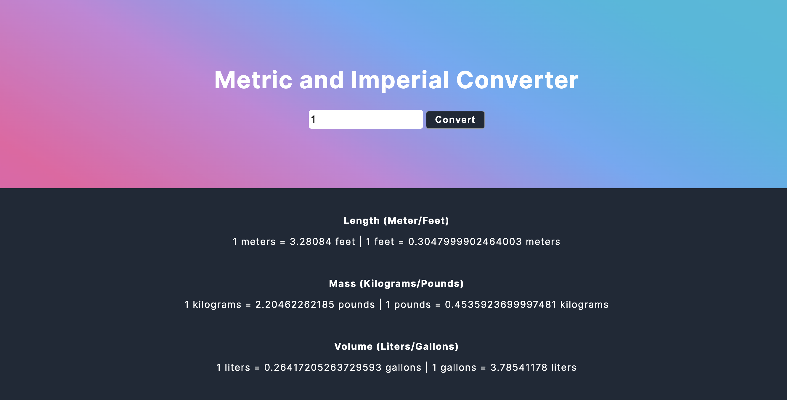

# Metric and Imperial Converter
Convert a number into metric and imperial units for length (Meter/Feet), mass (Kilograms/Pounds), and Volume (Liters/Gallons). Note that conversions may not be 100% accurate.

Created using CSS, HTML, and Javascript. 

